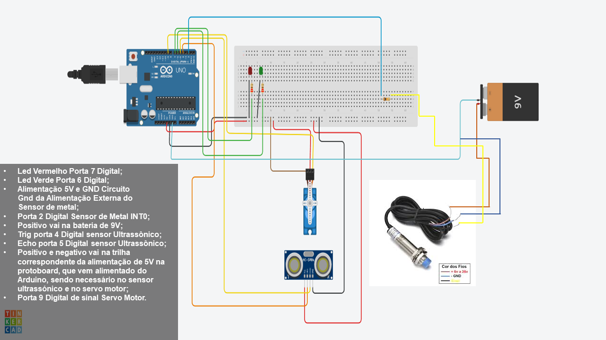

# PROJETO-SISTEMA_DE_SEPARACAO_METAL_E_NAO_METAL

Projeto desenvolvido para a disciplina de **Sistemas Embarcados** ministrada pelo **Prof. Henrique Patriota**.
**Alunos:** Marcelo Augusto e Pedro Pereira.

---

## Sistema detector de metais com atuador para descarte de materiais não metálicos 🚀 Descrição do Projeto:
Sistema embarcado para controle na separação de materiais metálicos e não metálicos, capaz de identificar a presença de um objeto e mover para a posição correta o objeto designado com auxílio do sensor indutivo, muito utilizado em ambientes industriais. Desenvolvido com o microcontrolador ATmega328P (Arduino Uno), o projeto utiliza técnicas de  **interrupções internas por timer**, **interrupções externas para o sensor de metal** e **controle direto de registradores** para otimizar desempenho.

---

## ⚙️ Funcionalidades
- **Leitura contínua de detecção de Objetos em um raio de 10cm** via sensor Ultrasônico.
- **Ativação automática do servo, após o estouro do timer** 2 segundos para metal e 4 segundos para não metal.
- **Indicação visual** com LEDs (vermelho para não metal, verde para metal).
- **Leitura visual serial na IDE** para auxiliar na identificação de qual movimento está ocorrendo.

---

## 📋 Componentes Utilizados
| Componente               | Especificações                          | Quantidade |
|--------------------------|-----------------------------------------|------------|
| Arduino Uno              | ATmega328P, 16 MHz, 5V                 | 1          |
| Servo Motor              | MG90S Torque: 2,2kg/cm (6,0V) / 1,8kg/cm (4,8V);    | 1          |
| Protoboard               | Quantidade de pontos: 830 e Tensão Máxima: 500V     | 1          |
| Sensor Ultrassônico      | HC-SR04 Distância: 2cm até 500cm e 5v (DC)          | 1          |
| Sensor Indutivo          | 6-36VDC, 300mA NPN de Proximidade LJ12A3-4-Z/BX     | 1          |
| LEDs                     | Vermelho e Verde (5mm)                              | 2          |
| Resistores               | 220Ω                                                | 2          |
| Resistores               | 10KΩ                                                | 1          |
| Bateria para o sensor indutivo   | 9VDC                                        | 1          |
| Jumpers                  | Conexão do Circuito                                 | 15          |
Extras/Opcional:
| Adaptador de Bateria de 9V    | P4 conexão                                     | 1          |
| Adaptador P4 Fêmea               | P4 conexão                                  | 1          |

---

## 🔧 Instalação
1. **Clonar o Repositório**:
   ``bash
   git clone https://github.com/marceloifpe/PROJETO-SISTEMA_DE_SEPARACAO_METAL_E_NAO_METAL
   ``

2. **Configurar Ambiente**:
   - Arduino IDE 2.x ou Microchip Studio for AVR

3. **Montagem do Hardware**:
   - Conectar componentes conforme o diagrama acima.
   - Alimentar Arduino via USB e Sensor Indutivo via bateria externa de 9V.

4. **Carregar Código**:
   - Abrir `código` na Arduino IDE.
   - Compilar e enviar para o Arduino Uno.

---

## 🎮 Uso
1. Ligue o Arduino via USB para alimentar os sensores ultrassônico, o servo motor e demais componentes.
2. posicione o sensor indutivo de metal junto a bateria externa de alimentação com 9V ou 12V para leitura correta.
3. O sistema iniciará, onde caso até dois segundos ele detecte metal o servo motor realizará o movimento para direita, se não após passar 4 segundos o servo motor realizará o movimnto para esquerda indicando que não é metal:
   - **LED verde**: indica que foi detectado um material metálico.
   - **LED vermelho**: indica que um material não metálico foi detectado.

---

## 📄 Licença
Este projeto está licenciado sob a GNU General Public License v3.0. Veja o arquivo [LICENSE](LICENSE) para detalhes.

---

## ✉️ Créditos
- **Professor Orientador**: Prof. Henrique Patriota
- **Desenvolvedores**: [Marcelo Augusto](https://github.com/marceloifpe) | [Pedro Pereira](https://github.com/PedroHLP25)